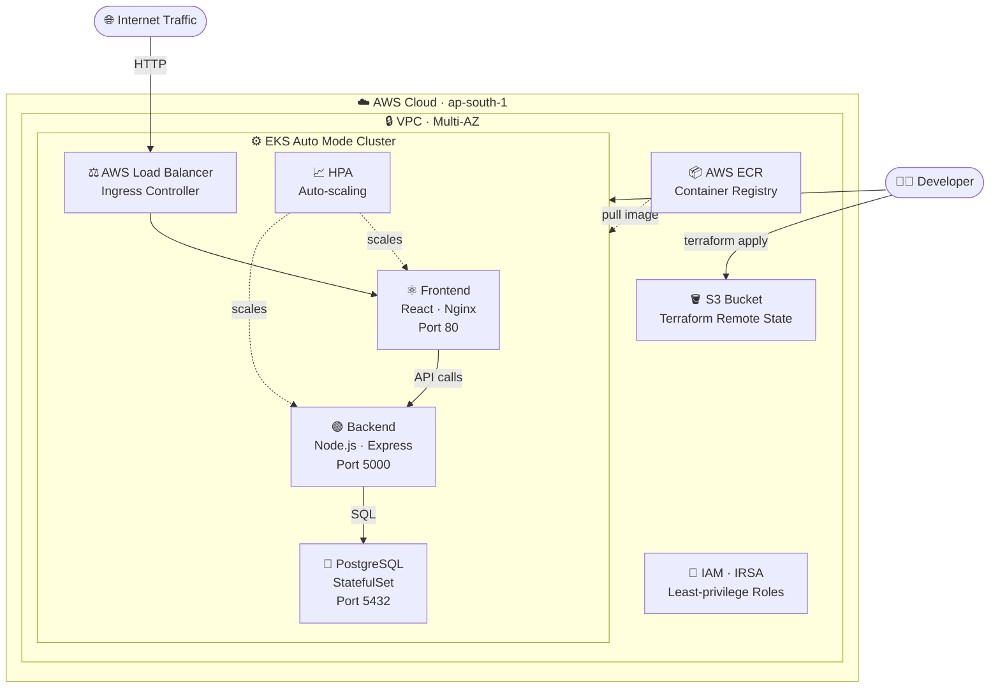
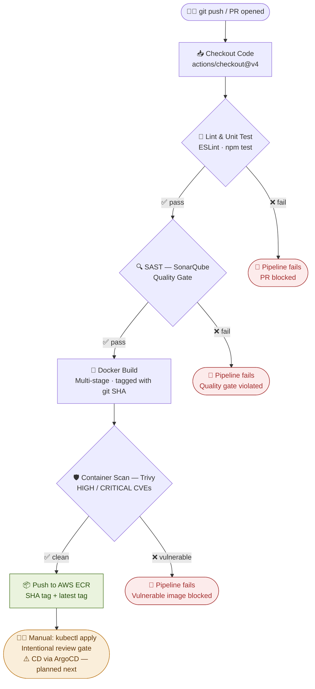

## 📐 Infrastructure Architecture



## 🗂️ Project Structure

```
3-tire-CI_CD-DevSecOps/ (devops branch)
│
├── .github/workflows/
│   └── ci.yml                 ← GitHub Actions CI pipeline
│
├── Terraform/
│   ├── main.tf                ← EKS Auto Mode cluster
│   ├── vpc.tf                 ← VPC, subnets, security groups
│   ├── ecr.tf                 ← ECR repositories
│   ├── variables.tf
│   └── outputs.tf
│
├── frontend/                  ← React (Vite) app
│   ├── src/
│   ├── Dockerfile             ← Multi-stage → Nginx
│   └── nginx.conf
│
├── backend/                   ← Node.js Express API
│   ├── src/
│   └── Dockerfile             ← Multi-stage → Node slim
│
├── k8s/                       ← Kubernetes manifests (manual apply)
│   ├── frontend-deployment.yml
│   ├── backend-deployment.yml
│   ├── postgres-statefulset.yml
│   ├── ingress.yml
│   └── hpa.yml
│
└── deploy/
    └── setup.sh               ← EC2 bare-metal fallback
```
## 🔄 CI Pipeline Flow



> **Why manual deploy?** The `kubectl apply` step is a deliberate review gate — CD automation via ArgoCD is the [next planned project](#roadmap).


🚀 Getting Started
Prerequisites
ToolVersionPurposeTerraform>= 1.6
Provision EKS clusterkubectl>= 1.29
Deploy to Kubernetes AWS CLI>= 2.x
AWS authenticationDocker>= 24
Local image buildNode.js>= 20

Local development
1. Provision Infrastructure (Terraform)
bashcd Terraform

# Initialise with remote state
terraform init

# Review the plan
terraform plan -out=tfplan

# Apply — provisions VPC, EKS, ECR, IAM roles
terraform apply tfplan

EKS Auto Mode handles node provisioning automatically — no node group management needed.

2. Configure kubectl
bashaws eks update-kubeconfig \
  --region ap-south-1 \
  --name jerney-cluster
3. Run CI Pipeline
Push to main or open a PR — the pipeline triggers automatically:
bashgit checkout devops
git add .
git commit -m "feat: your change"
git push origin devops
Pipeline stages run in sequence. A failure at any stage blocks the image from being pushed to ECR.
4. Deploy to Kubernetes (Manual Gate)
After the CI pipeline passes and image is in ECR:
bash# Update image tag in manifests
export IMAGE_TAG=$(git rev-parse --short HEAD)

# Apply manifests
kubectl apply -f k8s/

# Verify pods are running
kubectl get pods -n jerney
kubectl get ingress -n jerney

🔒 Security Controls
StageToolWhat It CatchesCode qualitySonarQubeCode smells, security hotspots, coverage gatesContainer CVEsTrivyHIGH/CRITICAL CVEs in base images and dependenciesSecretsGitHub Secret ScanningAccidental credential commitsIAMLeast-privilege rolesPods use IRSA — no static credentialsNetworkSecurity Groups + NetworkPolicyZero-trust pod-to-pod communication

⚙️ CI Pipeline Configuration
The pipeline is defined in .github/workflows/ci.yml and triggers on:

Push to main or devops branch
Pull requests targeting main

Required GitHub Secrets:
Secret Description AWS_ACCESS_KEY_IDIAM user for ECR pushAWS_SECRET_ACCESS_KEYIAM user secretAWS_REGIONe.g. ap-south-1ECR_REGISTRYYour ECR registry URLSONAR_TOKENSonarCloud project tokenSONAR_HOST_URLSonarQube server URL

🧱 Tech Stack
LayerTechnologyFrontendReact 18, Vite, NginxBackendNode.js 20, ExpressDatabasePostgreSQL 16ContainersDocker (multi-stage builds)OrchestrationKubernetes (AWS EKS Auto Mode)IaCTerraform >= 1.6CIGitHub ActionsSecurity (SAST)SonarQubeSecurity (container)TrivyRegistryAWS ECR

🗺️ Roadmap

 3-tier application (React + Node.js + PostgreSQL)
 Dockerised with multi-stage builds
 Terraform-provisioned EKS Auto Mode cluster
 GitHub Actions CI pipeline with security gates
 SonarQube SAST integration
 Trivy container vulnerability scanning
 Kubernetes manifests with HPA
 ArgoCD GitOps CD — eliminate manual kubectl apply (next project)
 Prometheus + Grafana observability stack
 Slack notifications on pipeline failure

👤
V K Harish Bodapati — DevOps Engineer | AWS | Kubernetes | Terraform
